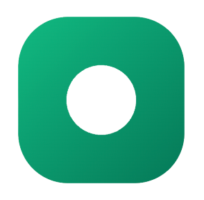
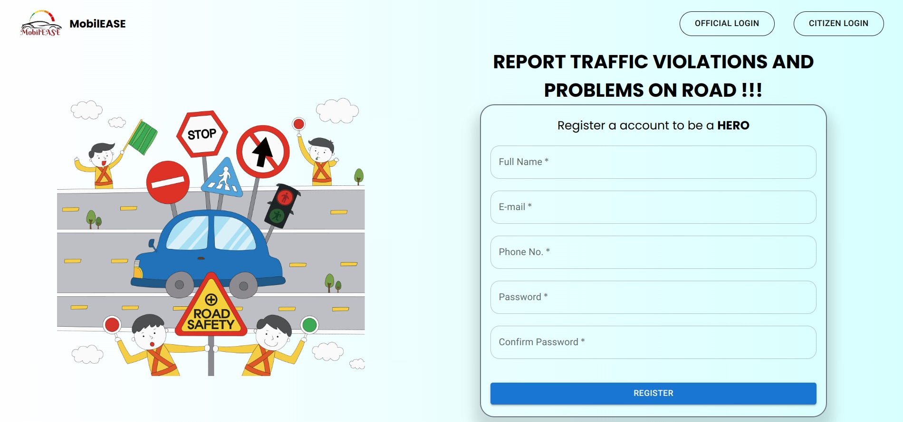
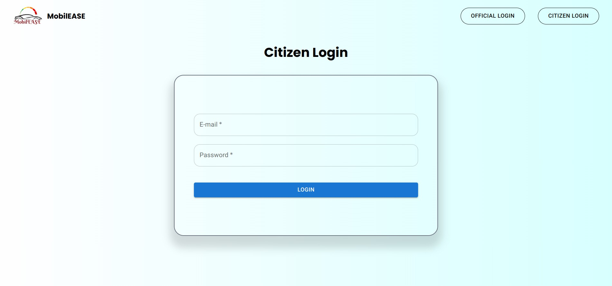
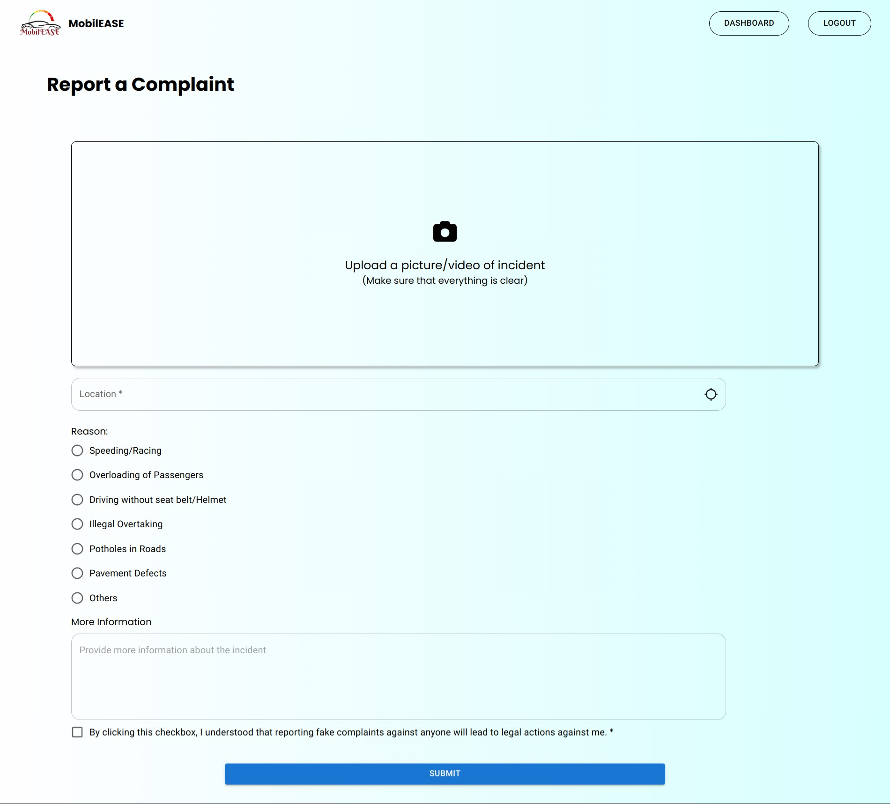
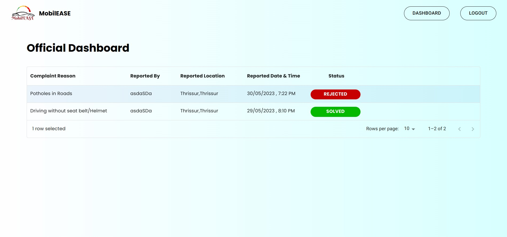
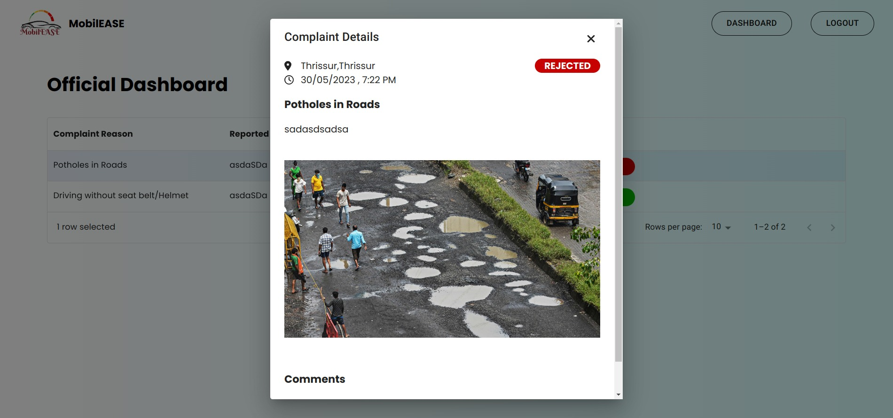
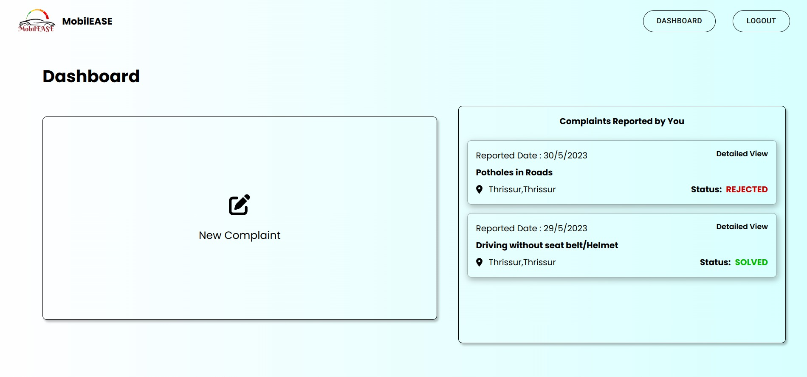

# MobilEASE



> A Cross-Platform Traffic Complaint System for reporting and managing traffic and civic issues.

[](https://reactjs.org/)
[](https://capacitorjs.com/)
[](https://firebase.google.com/)
[](https://opensource.org/licenses/MIT)

## Background / Problem Statement

The problem addressed by the MobilEASE is the prevalence of traffic chaos in urban areas due to a lack of efficient means for citizens to report incidents. The current system of reporting traffic incidents is often cumbersome, time-consuming, and ineffective, resulting in delayed resolution and increased frustration among citizens. This has led to a lack of accountability and transparency in governance and has negatively impacted the quality of life in cities. The proposed solution seeks to provide a user-friendly and convenient platform for citizens to report traffic incidents directly from their mobile devices. The system will utilize GPS technology to pinpoint the location of incidents and allow users to upload photos and videos as evidence, promoting a culture of civic responsibility
and collaboration.

## Features

### User Management
- Two types of users: Citizens and Officials
- Citizen self-registration
- Official accounts managed by admin
- Secure authentication with Firebase

### Complaint Management
- Report traffic violations and civic issues
- Attach photos/videos as evidence
- Real-time complaint tracking
- Status updates and notifications
- Location-based reporting using GPS

### Cross-Platform Support
- Progressive Web App (PWA)
- Native mobile apps for Android
- Completely responsive design
- Offline capabilities

### Additional Features
- Interactive dashboard for officials
- Citizen complaint history
- Admin panel for user management
- Push notifications
- Dark/Light theme support

## Screenshots

|  Home Page                   |  **Login Page**         |
| ------------------------------------------------------------------- | -------------------------------------------------------------- |
|  **Report Complaint Page**   |  **Official Dashboard** |
|  **Detailed Complaint View** |  **Citizen Dashboard**  |

## Tech Stack

### Frontend
- React 18 with Vite
- TypeScript
- Tailwind CSS for styling
- Material-UI (MUI) components
- Framer Motion for animations
- React Router for navigation

### Backend
- Firebase Authentication
- Cloud Firestore (NoSQL database)
- Firebase Cloud Storage
- Firebase Cloud Functions

### Mobile
- Capacitor 7.4.3
- Android SDK
- Java 17
- Gradle 8.1.2

### Development Tools
- Figma for UI/UX design
- Git for version control
- ESLint + Prettier for code quality
- Vite for development server
- Capacitor CLI for mobile development

## Getting Started

### Prerequisites
- Node.js 18+ (LTS recommended)
- npm or yarn
- Java 17 JDK
- Android Studio (for Android development)
- Firebase account

### Development Setup

1. Clone the repository
```bash
git clone https://github.com/vivekkj123/mobileEASE.git
cd mobileEASE
```

2. Install dependencies
```bash
npm install
# or
yarn
```

3. Set up Firebase
- Create a new Firebase project
- Enable Authentication (Email/Password)
- Set up Firestore Database
- Create a web app in Firebase console
- Create a `.env` file with your Firebase config (refer to `.env.example`)

4. Start development server
```bash
npm run dev
```

### Mobile App Development

#### Android Setup
1. Install Android Studio
2. Install Android SDK
3. Set up Android environment variables
4. Add Android platform to Capacitor
```bash
npx cap add android
```

5. Sync project with Android Studio
```bash
npx cap sync android
```

6. Open in Android Studio and run
```bash
npx cap open android
```

### Building for Production

#### Web
```bash
npm run build
```

#### Android
```bash
npm run build
npx cap sync android
# Open Android Studio and generate signed bundle/APK
```

## Environment Variables

Create a `.env` file in the root directory with the following variables:

```env
VITE_FIREBASE_API_KEY=your_api_key
VITE_FIREBASE_AUTH_DOMAIN=your_auth_domain
VITE_FIREBASE_PROJECT_ID=your_project_id
VITE_FIREBASE_STORAGE_BUCKET=your_storage_bucket
VITE_FIREBASE_MESSAGING_SENDER_ID=your_messaging_sender_id
VITE_FIREBASE_APP_ID=your_app_id
VITE_FIREBASE_MEASUREMENT_ID=your_measurement_id
```

## Running the Application

1. Start the development server:
    ```bash
    npm run dev
    ```
    The application will be available at `http://localhost:5173`

2. For production build:
    ```bash
    npm run build
    ```

## Contributing

1. Fork the repository
2. Create your feature branch (`git checkout -b feature/AmazingFeature`)
3. Commit your changes (`git commit -m 'Add some AmazingFeature'`)
4. Push to the branch (`git push origin feature/AmazingFeature`)
5. Open a Pull Request

## License

Distributed under the MIT License. See `LICENSE` for more information.

## Contact

Project Link: [https://github.com/vivekkj123/mobileEASE](https://github.com/vivekkj123/mobileEASE)

## Acknowledgments

- [Vite](https://vitejs.dev/)
- [React](https://reactjs.org/)
- [Firebase](https://firebase.google.com/)
- [Capacitor](https://capacitorjs.com/)
- [Tailwind CSS](https://tailwindcss.com/)
- [Material-UI](https://mui.com/)
